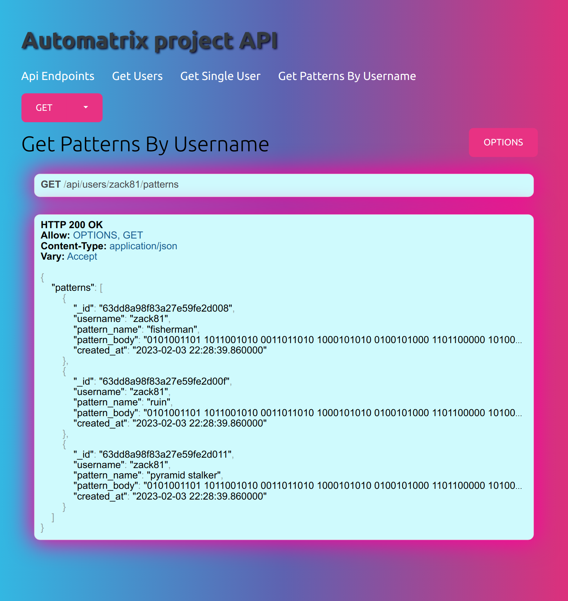
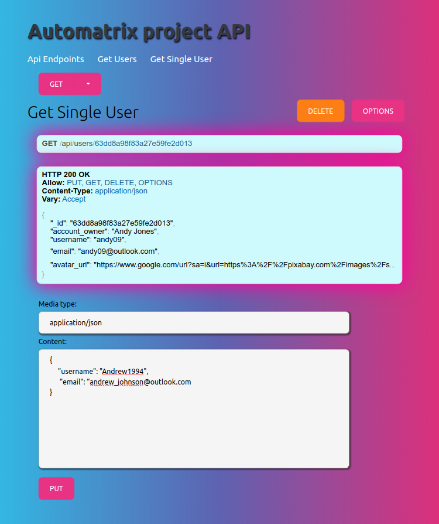
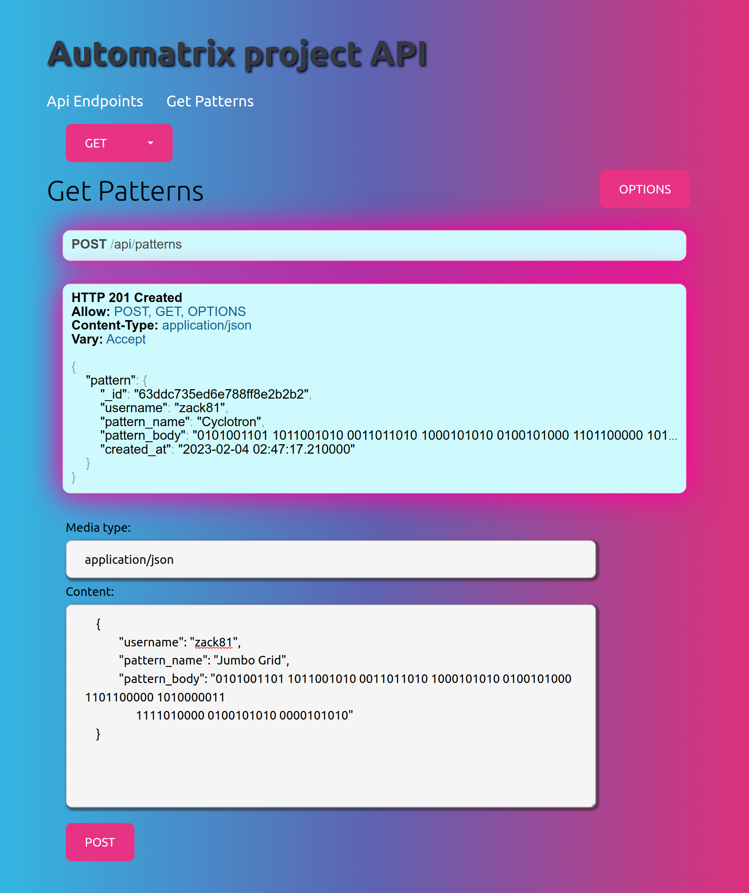

# API project featuring Django Rest Framework and MongoDB

Welcome to another one of my backend projects. Here I have created a NoSQL web API with Django REST framework featuring full CRUD functionality and exhaustive integration testing. This API is built upon a document data model and is connected to document collections hosted on a MongoDB database cluster.

Visit the link above to view the browsable API which will enable you to explore all of the API's features.

## Key product features:
- Browsable front-end with responsive design elements.
- Based on an MVT design pattern.
- Variety of endpoints providing GET, POST, PUT and DELETE functionality.
- Extensive error handling with custom error messages for distinct concerns.
- Full integration testing using Django's test case class.
- Function-based views and class-based tests.
- Virtual environment for project dependencies.
- Multi-app project structure, in line with best practice.

## Screenshots
Making a GET request for all patterns by a specific user:
 

 
Making a PUT request for a user:
 

 
Making a POST request:
 
